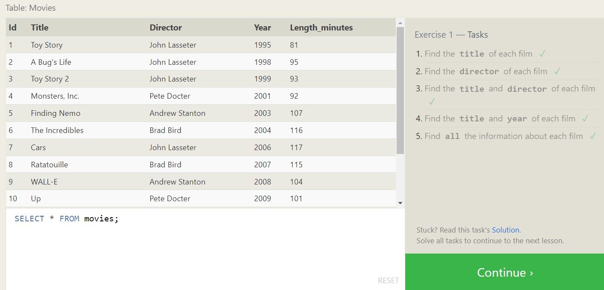

### Summary of SQL Concepts and Operations

#### Introduction to SQL
SQL (Structured Query Language) is a powerful tool for managing relational databases.

#### SQL Lesson 1: SELECT Queries 101
The `SELECT` statement retrieves data from a database table. Basic syntax:
```sql
SELECT column1, column2 FROM table_name;
```

#### SQL Lesson 2: Queries with Constraints (Pt. 1)
Constraints like `WHERE` filter query results based on specified conditions:
```sql
SELECT * FROM employees WHERE department = 'IT';
```

#### SQL Lesson 3: Queries with Constraints (Pt. 2)
Additional constraints like `AND`, `OR`, and `NOT` can be combined for more complex filtering:
```sql
SELECT * FROM employees WHERE department = 'IT' AND age > 30;
```

#### SQL Lesson 4: Filtering and Sorting Query Results
Sorting with `ORDER BY` arranges query results in ascending or descending order:
```sql
SELECT * FROM employees ORDER BY salary DESC;
```

#### SQL Review: Simple SELECT Queries
Recap on basic `SELECT` queries:
```sql
SELECT * FROM customers;
```

#### SQL Lesson 6: Multi-table Queries with JOINs
JOINs combine data from multiple tables based on related columns. Example:
```sql
SELECT * FROM employees
JOIN departments ON employees.department_id = departments.id;
```

#### SQL Lesson 7: OUTER JOINs
Outer JOINs include unmatched rows from one or both tables. Example:
```sql
SELECT * FROM employees
LEFT JOIN departments ON employees.department_id = departments.id;
```

#### SQL Lesson 8: A Short Note on NULLs
`NULL` represents missing or unknown data. Use `IS NULL` or `IS NOT NULL` for filtering:
```sql
SELECT * FROM employees WHERE email IS NULL;
```

#### SQL Lesson 9: Queries with Expressions
Expressions calculate values within queries. Example:
```sql
SELECT first_name, last_name, salary * 12 AS annual_salary FROM employees;
```

#### SQL Lesson 10: Queries with Aggregates (Pt. 1)
Aggregate functions like `COUNT`, `SUM`, `AVG`, `MIN`, and `MAX` summarize data:
```sql
SELECT COUNT(*) FROM employees;
```

#### SQL Lesson 11: Queries with Aggregates (Pt. 2)
Grouping data with `GROUP BY` and filtering groups with `HAVING`:
```sql
SELECT department_id, COUNT(*) FROM employees GROUP BY department_id HAVING COUNT(*) > 5;
```

#### SQL Lesson 12: Order of Execution of a Query
Understanding the sequence of SQL query execution:
1. `FROM` and `JOIN`
2. `WHERE`
3. `GROUP BY`
4. `HAVING`
5. `SELECT`
6. `DISTINCT`
7. `ORDER BY`
8. `LIMIT` and `OFFSET`

#### SQL Lesson 13: Inserting Rows
`INSERT INTO` adds new rows to a table:
```sql
INSERT INTO employees (first_name, last_name) VALUES ('John', 'Doe');
```

#### SQL Lesson 14: Updating Rows
`UPDATE` modifies existing rows:
```sql
UPDATE employees SET salary = 60000 WHERE id = 1;
```

#### SQL Lesson 15: Deleting Rows
`DELETE FROM` removes rows:
```sql
DELETE FROM employees WHERE id = 1;
```

#### SQL Lesson 16: Creating Tables
`CREATE TABLE` defines new tables:
```sql
CREATE TABLE departments (
    id INT PRIMARY KEY,
    name VARCHAR(255)
);
```

#### SQL Lesson 17: Altering Tables
`ALTER TABLE` modifies existing tables:
```sql
ALTER TABLE employees ADD COLUMN email VARCHAR(255);
```

#### SQL Lesson 18: Dropping Tables
`DROP TABLE` deletes tables:
```sql
DROP TABLE employees;
```
#### Screenshots taken from SQLBolt.com



